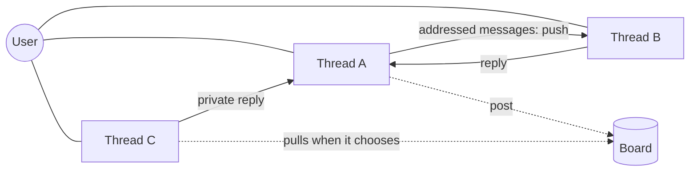

# Thread collaboration — design v1 (draft)

Status: proposal, T820. Nothing implemented yet.

## 1. Problem

Several threads now run at the same time (K=2 run at once, N threads per agent process), but they cannot work together. Today:

- `Send` accepts **any** `thread_id`. It appends the message with `author=Assistant`, so in thread B a message from A **reads as B's own reply**. It never wakes B. Nothing stops this misuse.
- `ThreadAuthor` has only two values: `User` and `Assistant`. A message cannot say it came from another thread.
- The wake path already exists. K7 `apply_send_message` sets the thread to `MyTurn`, then `App::deliver_to_thread` runs the hooks on the target's own state and clears `Errored`. But that path also resets the auto-continuation counters, which would let two threads ping-pong forever.

## 2. What the research says (7 sources, details in the T820 scratchpad)

| # | Finding | Source |
|---|---|---|
| R1 | Few links beat everyone-talks-to-everyone. Full mesh costs 3–8× the tokens, spreads errors, and gains stop at about 4 agents. | GTD 2510.07799, sparse debate 2406.11776, AgentPrune 2410.02506 |
| R2 | Letting agents **volunteer** beats assigning them: public request, self-selected helpers, replies **private** to the requester. +13–57%. | Blackboard MAS 2510.01285 |
| R3 | Most failures are "doesn't know when to stop" (12%), repeated steps (16%), ignoring input, never asking for clarification, keeping information back. Free chat makes these worse. A typed message with an owner and an end condition prevents them. | MAST 2503.13657 |
| R4 | A delegation must state goal, output format, sources and limits. Pass **references to files**, not retold content. Agents sending each other too many updates hurt results. | Anthropic multi-agent research system |
| R5 | One accountable owner decides, plus an independent check (+9–16%). | MAST / ChatDev |
| R6 | Memory is private by default and published explicitly. Every shared item records who wrote it, when, and from what sources. | Collaborative Memory 2505.18279 |
| R7 | Multi-agent costs about 15× chat. Effort must be capped: 1 helper for simple tasks, 2–4 for comparisons. | Anthropic |

## 3. Shape of the communication graph



- **No mesh, no all-hands chat.** Push happens only along addressed edges, one sender to one recipient (R1).
- **Broadcast happens only through the board, and only by pull (R2, R4).** Posting wakes no one. A thread reads the board when it is idle or when it chooses to.
- The user stays the hub for direction. Threads coordinate between themselves on the details.

## 4. Building blocks

### 4.1 Typed message (thread → thread)

New `ThreadAuthor::Peer { thread_id }`. New tool **`Message`**. `Send` stays human-facing only, and gets a guard: Send to a thread other than the current one is rejected, with a hint to use `Message`.

```yaml
Message:
  to: T812
  intent: request | inform | clarify | answer | done | decline
  body: markdown
  refs: [path/or/note-id, ...]   # pass references, not copies (R4)
  reply_to: msg-id               # threads a conversation
  expects: reply | nothing       # end condition (R3)
```

| intent | Wakes the target? | Meaning |
|---|---|---|
| request | yes | "Please do or answer X". The body must give goal, expected output and limits (enforced by the tool description) |
| clarify | yes | Question back to the sender (a first-class type, R3) |
| answer | yes, if the sender is waiting on it | Reply to a request or clarify |
| inform | **no**. Shown as unread, read on the next turn | FYI |
| done / decline | no | Closes the conversation (end condition) |

Delivery reuses the K7 wake path (`push` + `MyTurn` + `deliver_to_thread`), **but without the counter reset**. The target's transcript shows `from T805 (request): …`. The human sees everything.

### 4.2 Conversations and their limits

- Each `request` opens a conversation `{id, owner=sender, participants, hops, state}`. The **owner** closes it with `done` (R5).
- **Hop limit** (default 8 messages per conversation). When it is reached, the thread is notified and the system posts the problem to the user in the owner thread. This stops ping-pong.
- **Limit on open requests per thread** (default 3, R7).
- The K=2 cap still applies: a woken thread waits in line. A sender never blocks on a reply. The reply arrives as a wake.

### 4.3 Board (blackboard)

```yaml
Post: { kind: help_wanted | finding | decision, title, body, tags, refs }
```

- Fixed `Board` panel: open posts, newest first, title + tags + author + age, capped at about 15 lines.
- Volunteering: a thread that can help replies with `Message(to=poster, intent=answer, reply_to=post)`. The reply is **private** to the poster (R2). An optional `claim` prevents duplicated work.
- The poster closes the post. Posts expire after a set time (default 24h) so the board does not fill with stale items.
- `decision` posts are the shared memory between threads: "we chose X because Y, see refs".

### 4.4 Shared knowledge

- Notes, todos and the scratchpad stay **private to each thread** (current model, R6).
- `Post(kind=finding|decision)` is the explicit "publish" act. Each post carries `author_thread`, `ts`, `refs` (provenance), so a reader can judge whether it is stale.
- Large content goes into a file in the repo or `tmp/`, and the message carries only the path (R4).

### 4.5 Group rooms — **not in v1**

The evidence (R1, R4, R7) says they cost more and add noise. If they are ever needed: at most 4 members, a named owner, an end condition, and the owner publishes a summary instead of everyone talking to everyone.

## 5. Concrete code changes (v1)

1. `cp-mod-threads/types`: `ThreadAuthor::Peer{thread_id}` + `ThreadMessage.meta: Option<PeerMeta{intent, reply_to, conv_id, refs}>` (serde default, persistence stays compatible).
2. `Message` tool + guard on `Send` (no target other than the current thread).
3. Delivery: new `App::deliver_peer(to, msg)` = push + `MyTurn` (when the intent wakes) + `clear_errored_entry`, **without** `on_user_message`.
4. `Conversation` registry in `ThreadsState`: hop counter, open-request counter, closing.
5. `Board`: `BoardState` (shared, persisted) + `Post`/`Claim`/`Close` tools + panel.
6. Prompt text: collaboration rules (when to delegate, how much effort, always pass refs), in yamls (watch the refusal wording, see the Opus 5.5 incident).
7. Frontend: a "from T805 · request" badge on peer messages, and a Board tab later.

## 6. Open questions (for the user)

1. **Scope**: threads of one agent process only (v1, simple), or also across agents/folders through the orchestrator (wire changes)?
2. **Wake policy**: can a `request` wake an idle thread on its own, or does it wait for the user?
3. **Human oversight**: are peer messages visible in the transcript without approval, or does each `request` need the user's approval?
4. **Rooms**: confirm they are left out of v1?
