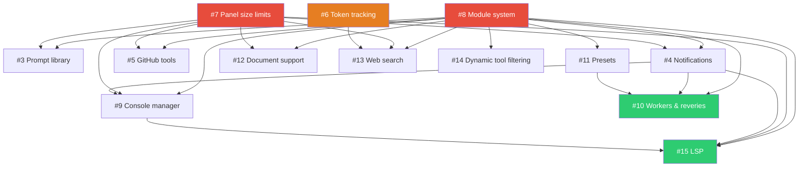

# Issue Dependency Graph

```mermaid
graph TD
    8["#8 Module system"] --> 3["#3 Prompt library"]
    8 --> 4["#4 Notifications"]
    8 --> 5["#5 GitHub tools"]
    8 --> 9["#9 Console manager"]
    8 --> 10["#10 Workers & reveries"]
    8 --> 11["#11 Presets"]
    8 --> 12["#12 Document support"]
    8 --> 13["#13 Web search"]
    8 --> 14["#14 Dynamic tool filtering"]
    8 --> 15["#15 LSP"]

    7["#7 Panel size limits"] --> 3
    7 --> 4
    7 --> 5
    7 --> 9
    7 --> 12
    7 --> 13
    7 --> 15

    6["#6 Token tracking"] --> 13

    4 --> 9
    4 --> 10
    4 --> 15

    11 --> 10

    9 --> 15

    style 8 fill:#e74c3c,color:#fff
    style 7 fill:#e74c3c,color:#fff
    style 6 fill:#e67e22,color:#fff
    style 15 fill:#2ecc71,color:#fff
    style 10 fill:#2ecc71,color:#fff
```

Arrows read as "blocks". Red = foundations (most blocking). Orange = independent foundation. Green = most blocked.
